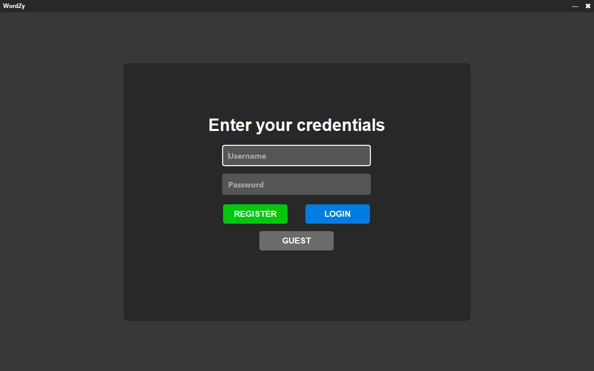
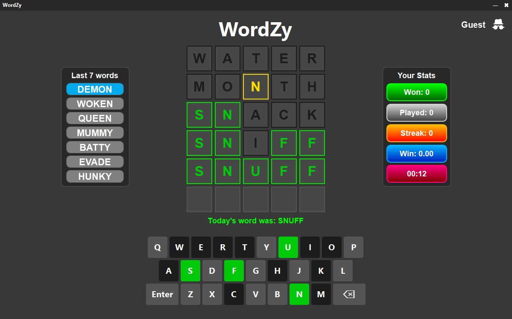

# WordZy - Python Wordle Clone


## 📖 About The Project

**WordZy** is a modern, desktop-based clone of the popular game Wordle, built using Python and **PySide6**. 

Unlike the web version, WordZy features a robust **user authentication system**, persistent **statistics tracking** via SQLite, and a custom frameless dark-mode UI. It connects to online word repositories to validate guesses and fetch daily challenges.


### 📷 Screenshots

| Start Screen | Gameplay |
|:---:|:---:|
|  |  |


---

## ✨ Key Features

* **Classic Mechanics:** 6 attempts to guess a 5-letter word with color-coded feedback (Green/Yellow/Gray).
* **User System:**
    * **Authentication:** Secure Registration and Login with password hashing (`bcrypt`).
    * **Guest Mode:** Play without saving stats.
* **Detailed Statistics:**
    * Tracks Wins, Total Games, Win %, and Current Streak.
    * Visual representation of "Last 7 Words".
    * Fastest completion time tracking.
* **Modern UI/UX:**
    * Frameless window with custom title bar (minimize/close).
    * Dark theme styled with Qt stylesheets (CSS-like).
    * On-screen virtual keyboard with dynamic color updates.
    * Full physical keyboard support.
* **Smart Backend:**
    * **SQLite Database:** Stores user profiles and game history locally.
    * **Daily Reset:** Automatically resets the puzzle and streak logic daily.
    * **Online Validation:** Fetches valid word lists dynamically via `requests`.

---

## 🛠️ Tech Stack

* **Language:** Python 3
* **GUI Framework:** PySide6 (Qt for Python)
* **Database:** SQLite3
* **Security:** Bcrypt (for password hashing)
* **Networking:** Requests (fetching word lists)

---

## 🚀 Getting Started

### Prerequisites

Ensure you have Python installed. You will need the following packages:

* PySide6
* requests
* bcrypt

### Installation

1.  **Clone the repository**
    ```bash
    git clone https://github.com/mk-ehe/WordZy.git
    cd WordZy
    ```

2.  **Install dependencies**
    It is recommended to use a virtual environment.
    ```bash
    pip install -r requirements.txt
    ```

3.  **Run the Application**
    ```bash
    python main.py
    ```

---

## 📂 Project Structure

```text
WordZy/
├── main.py           # Main entry point and Game Logic
├── database.py       # Database handling
├── Entry.py          # Login UI
├── requirements.txt  # List of dependencies
├── logo.png          # Assets
├── start_screen.png  # Assets
├── game_screen.png   # Assets
└── README.md         # Documentation